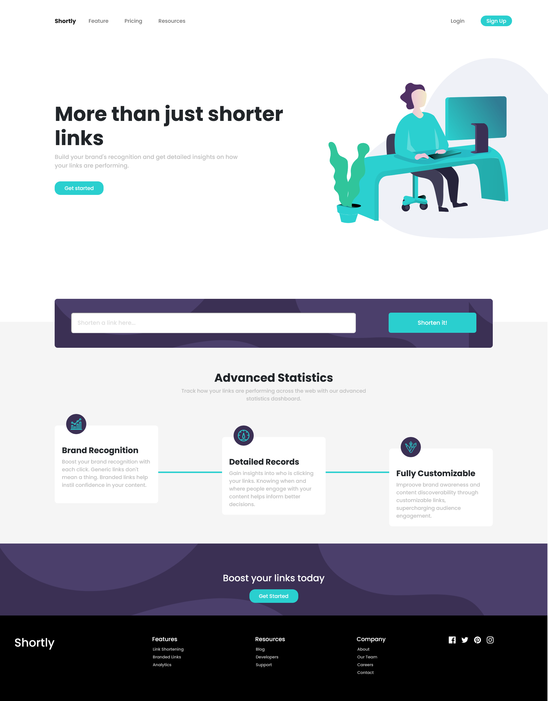
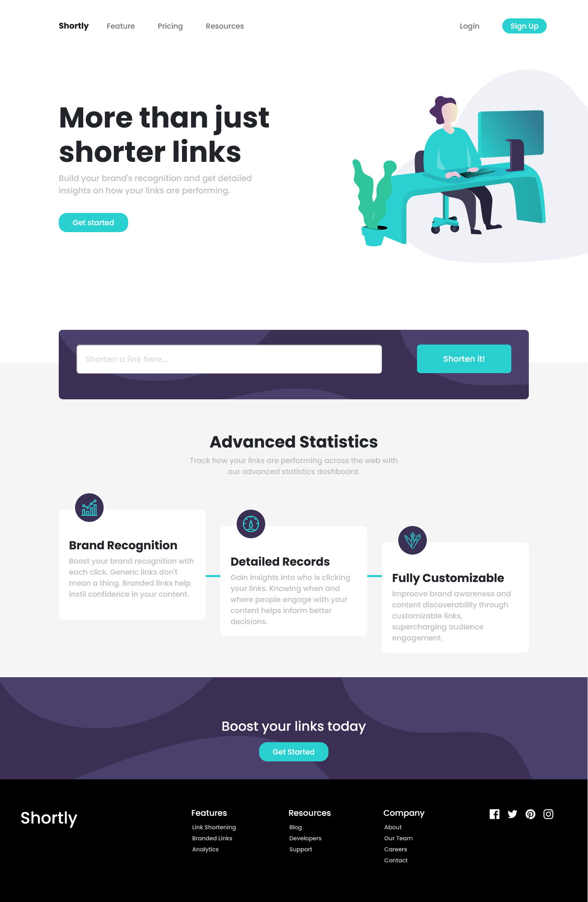
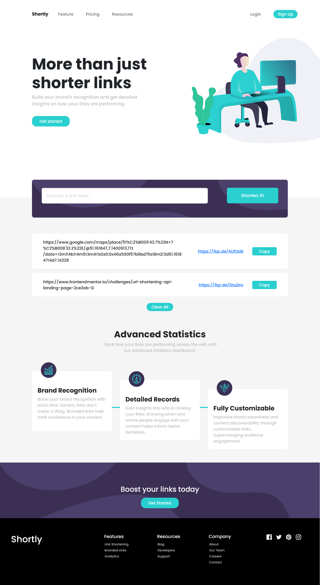
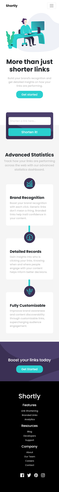
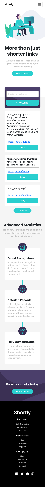
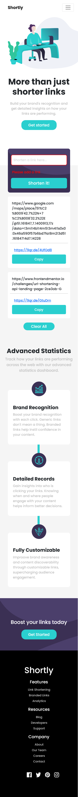

# Frontend Mentor - Shortly URL shortening API Challenge solution

This is a solution to the [Shortly URL shortening API Challenge challenge on Frontend Mentor](https://www.frontendmentor.io/challenges/url-shortening-api-landing-page-2ce3ob-G). Frontend Mentor challenges help you improve your coding skills by building realistic projects. 

## Table of contents

- [Overview](#overview)
  - [The challenge](#the-challenge)
  - [Screenshots](#screenshot)
  - [Links](#links)
## Overview

### The challenge

Users should be able to:

- View the optimal layout for the site depending on their device's screen size
- Shorten any valid URL
- See a list of their shortened links, even after refreshing the browser
- Copy the shortened link to their clipboard in a single click
- Receive an error message when the `form` is submitted if:
  - The `input` field is empty

### Screenshots

#### Large Desktop View

#### Desktop View (1440px)

#### Desktop View with links (1440px)

#### Desktop View Active (1440px)

#### Mobile View (375px)

#### Mobile View with links (375px)

#### Mobile View Active (375px)

### Links

- Solution URL: [GitHub link](https://github.com/MarianaPantelic/Shorten-URLs)
- Live Site URL: [Vercel Link](https://shorten-url-s.vercel.app/)

### Built with

- [React](https://reactjs.org/) - JS library

